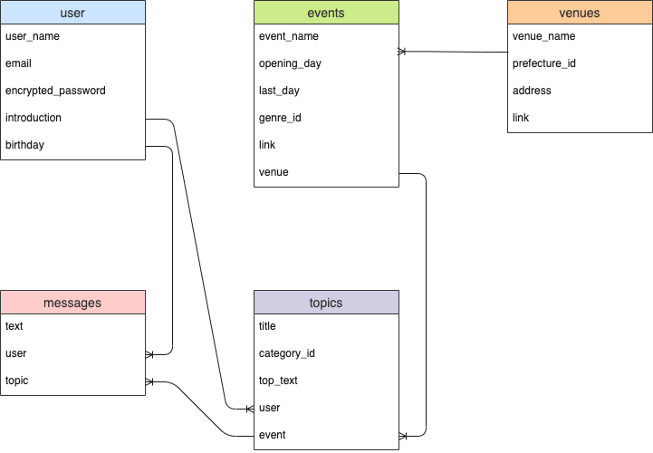
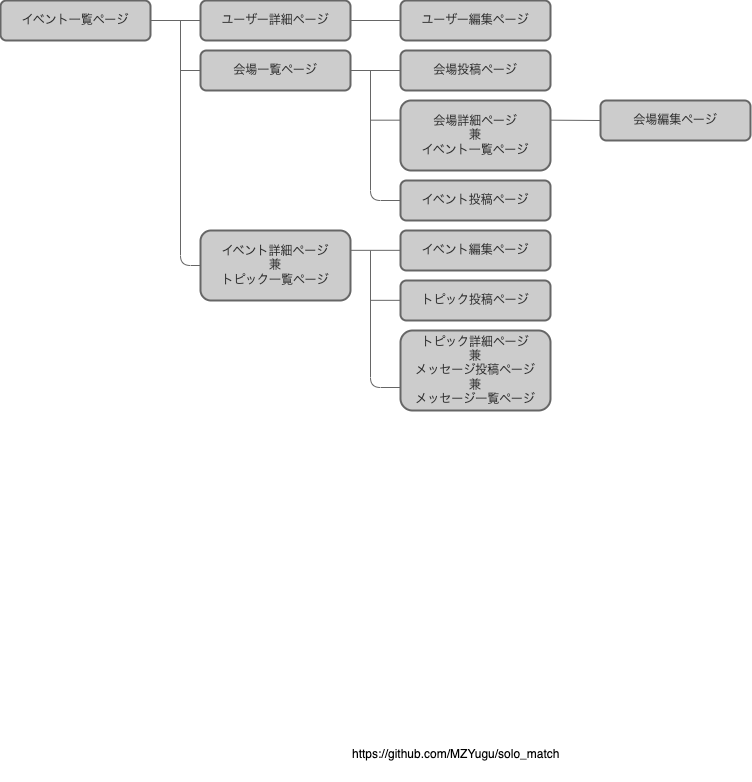

# README
アプリケーション名『Solo_Match』

# 概要
同じイベントに参加するファン同士が交流するためのサービス

# URL
XXX（実装後に記載）

# テストアカウント
XXX（実装後に記載）
# 利用方法
XXX（実装後に記載）
# 開発背景
SNSを見ていると、普段1人で趣味を楽しんでいる人もイベントに参加するとなれば会場付近で同じイベントに参加する人との交流や感想の共有を求めている。  
汎用的なSNSで「イベント名」「作品名」などを検索することなく素早く仲間へアクセスをするために、イベント参加者をターゲットにしたウェブアプリを開発することにした。

# 用件定義
[用件定義したシート](https://docs.google.com/spreadsheets/d/14EgJxHWEPgLfPCoFmN1G1AwtuAlIEtF8n_0UjZtfS9Q/edit?usp=sharing)

# 実装した機能についての説明
XXX（実装後に記載）

# 実装予定の機能
### 検索機能の充実
一覧ページで地域、イベントジャンルを絞り込んで表示する機能
### 外部SNSへの共有機能
自分が作成したtopicをSNSへ共有する機能
### ユーザー年齢による機能の制限
性質上イベント会場で直接交流する可能性が高い投稿へは、トラブルを防ぐために18歳以下にユーザーがメッセージを投稿できない制限

# データベース設計

# 画面遷移図

# 開発環境
ruby 2.6.5  
Rails 6.0.6.1  
Visual Studio Code

# ローカルでの操作方法
% git clone https://github.com/MZYugu/solo_match  
% cd solo-match  
% bundle install  
% yarn install

# 工夫したポイント
XXXXXX（実装後に記載）